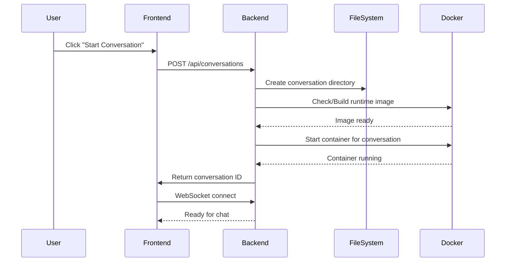
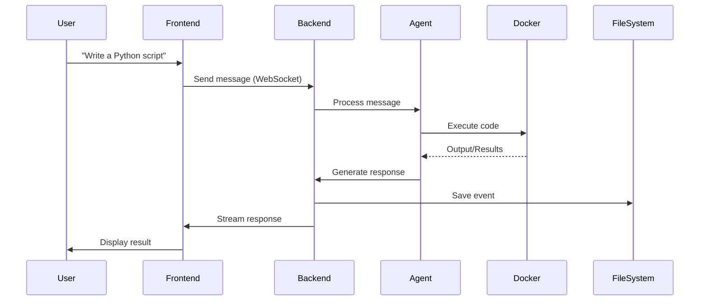

# OpenHands Data Flow & Storage Architecture

## Overview

This document explains how data flows through OpenHands, where it's stored, and how Docker containers are managed for each conversation.

## 🏗️ High-Level Architecture

```
┌─────────────────────────────────────────────────────────────────────────┐
│                              YOUR BROWSER                                │
│  ┌─────────────────┐    ┌──────────────────┐    ┌──────────────────┐  │
│  │   React UI      │────│   WebSocket      │────│   Settings UI    │  │
│  │  (Port 3001)    │    │   Connection     │    │   (API Keys)     │  │
│  └────────┬────────┘    └────────┬─────────┘    └────────┬─────────┘  │
└───────────┼──────────────────────┼────────────────────────┼────────────┘
            │ HTTP Requests        │ Real-time Events       │ Save Settings
            ▼                      ▼                        ▼
┌─────────────────────────────────────────────────────────────────────────┐
│                          BACKEND (Port 3000)                            │
│  ┌─────────────────┐    ┌──────────────────┐    ┌──────────────────┐  │
│  │   FastAPI       │    │   WebSocket      │    │   Settings       │  │
│  │   REST API      │────│   Handler        │────│   Manager        │  │
│  └────────┬────────┘    └────────┬─────────┘    └────────┬─────────┘  │
│           │                      │                        │             │
│           ▼                      ▼                        ▼             │
│  ┌─────────────────────────────────────────────────────────────────┐  │
│  │                     Session Manager                              │  │
│  │  - Creates conversations                                         │  │
│  │  - Manages agent lifecycle                                       │  │
│  │  - Handles Docker runtime                                        │  │
│  └──────────────────┬──────────────────────────────────────────────┘  │
└────────────────────┼───────────────────────────────────────────────────┘
                     │
                     ▼
┌─────────────────────────────────────────────────────────────────────────┐
│                          FILE STORAGE (~/.openhands/)                   │
│  ┌─────────────────┐    ┌──────────────────┐    ┌──────────────────┐  │
│  │  conversations/ │    │   settings.json  │    │    secrets/      │  │
│  │  └─{conv_id}/   │    │   (UI prefs,     │    │  (encrypted      │  │
│  │    └─events.json│    │    agent config) │    │   API keys)      │  │
│  └─────────────────┘    └──────────────────┘    └──────────────────┘  │
└─────────────────────────────────────────────────────────────────────────┘
                     │
                     ▼
┌─────────────────────────────────────────────────────────────────────────┐
│                     DOCKER RUNTIME CONTAINERS                           │
│  ┌─────────────────────────────────────────────────────────────────┐  │
│  │  Runtime Image: ghcr.io/all-hands-ai/runtime:oh_v0.50.0_...     │  │
│  │  ┌─────────────────┐    ┌──────────────────┐                    │  │
│  │  │ Container 1     │    │  Container 2     │    ...             │  │
│  │  │ (Conv: abc123)  │    │  (Conv: def456)  │                    │  │
│  │  │ - Python env    │    │  - Python env    │                    │  │
│  │  │ - File system   │    │  - File system   │                    │  │
│  │  │ - Terminal      │    │  - Terminal      │                    │  │
│  │  └─────────────────┘    └──────────────────┘                    │  │
│  └─────────────────────────────────────────────────────────────────┘  │
└─────────────────────────────────────────────────────────────────────────┘
```

## 📁 Data Storage Locations

### 1. User Settings & Preferences
**Location**: `~/.openhands/settings.json`
```json
{
  "llm_model": "gemini/gemini-2.0-flash-exp",
  "agent": "CodeActAgent",
  "language": "en",
  "confirmation_mode": false,
  "security_analyzer": "default"
}
```

### 2. API Keys (Encrypted)
**Location**: `~/.openhands/secrets/`
- Stored encrypted on disk
- Never sent to external servers
- Accessed only by your local OpenHands instance

### 3. Conversations
**Location**: `~/.openhands/conversations/{conversation_id}/`
```
~/.openhands/conversations/
└── 50179845e50047508b37194d5aa16bbf/
    ├── events.json          # All conversation events
    ├── metadata.json        # Conversation metadata
    └── trajectory.json      # Agent action history
```

### 4. Workspace Files
**Location**: `~/.openhands/workspace/`
- Files created/modified during conversations
- Persists between sessions
- Can be mounted into Docker containers

## 🐳 Docker Container Management

### How Containers Work

1. **One Container Per Conversation**
   ```
   Conversation A → Container A (isolated)
   Conversation B → Container B (isolated)
   Conversation C → Container C (isolated)
   ```

2. **Container Lifecycle**
   ```
   User starts conversation
           ↓
   System checks for runtime image
           ↓
   [First time: Build image]
   [Subsequent: Use cached image]
           ↓
   Start new container for this conversation
           ↓
   Agent executes code in container
           ↓
   Conversation ends → Container stops
   ```

3. **Why Docker Even in Development?**
   - **Safety**: Agent can't accidentally delete your files
   - **Isolation**: Each conversation has clean environment
   - **Reproducibility**: Same environment every time
   - **Security**: Limits what AI can access

### Container Details

```yaml
Container Name: openhands-runtime-{conversation_id}
Base Image: ghcr.io/all-hands-ai/runtime:oh_v0.50.0_...
Resources:
  - Memory: Limited based on config
  - CPU: Shared with host
  - Network: Can make external requests
Mounts:
  - Workspace directory (optional)
  - Shared cache directory
Environment:
  - Python 3.11+
  - Common development tools
  - Git, npm, etc.
```

## 🔄 Data Flow Sequence

### Starting a Conversation



### During Conversation



## 💾 Data Persistence

### What Persists:
1. **Conversations**: All chat history in `~/.openhands/conversations/`
2. **Settings**: Your preferences in `~/.openhands/settings.json`
3. **API Keys**: Encrypted in `~/.openhands/secrets/`
4. **Workspace**: Files created by agent in `~/.openhands/workspace/`

### What Doesn't Persist:
1. **Container State**: Each conversation starts fresh
2. **Installed Packages**: In container (unless saved to workspace)
3. **Environment Variables**: Set per session

## 🔐 Security & Privacy

### API Key Storage
```
User enters API key in UI
         ↓
Frontend sends to backend (HTTPS in production)
         ↓
Backend encrypts key
         ↓
Stored in ~/.openhands/secrets/
         ↓
Decrypted only when needed for LLM calls
```

### Data Isolation
- Each conversation has its own container
- Containers can't access your host filesystem (except mounted workspace)
- API keys never leave your machine
- All data stored locally

## 🚀 Performance Optimization

### Docker Image Caching
- First build: ~2-5 minutes (downloading base layers)
- Subsequent starts: ~5-10 seconds (using cached image)
- Images shared across conversations (same base)

### Resource Management
```
Active Conversations: 3
├── Container 1: 512MB RAM
├── Container 2: 512MB RAM
└── Container 3: 512MB RAM
Total Docker Usage: ~1.5GB RAM
```

## 📊 Multi-User Considerations

**Current Design**: Single-user local installation
- All data in user's home directory
- No user authentication built-in
- Not suitable for shared servers

**For Multi-User** (future):
```
/data/
├── users/
│   ├── user1/
│   │   ├── settings.json
│   │   ├── conversations/
│   │   └── secrets/
│   └── user2/
│       ├── settings.json
│       ├── conversations/
│       └── secrets/
```

## 🔍 Debugging Data Flow

### Check Conversation Data
```bash
# List all conversations
ls ~/.openhands/conversations/

# View specific conversation events
cat ~/.openhands/conversations/{id}/events.json | jq

# Check current settings
cat ~/.openhands/settings.json | jq
```

### Monitor Docker Containers
```bash
# List OpenHands containers
docker ps | grep openhands-runtime

# View container logs
docker logs openhands-runtime-{conversation_id}

# Check resource usage
docker stats
```

## Summary

1. **All data stored locally** in `~/.openhands/`
2. **Each conversation gets its own Docker container**
3. **Containers are isolated** but share the same base image
4. **API keys are encrypted** and never leave your machine
5. **Docker is used even in development** for security and isolation
6. **First image build is slow**, subsequent starts are fast

This architecture ensures your development environment is safe, your data is private, and each conversation has a clean, isolated environment to work in.